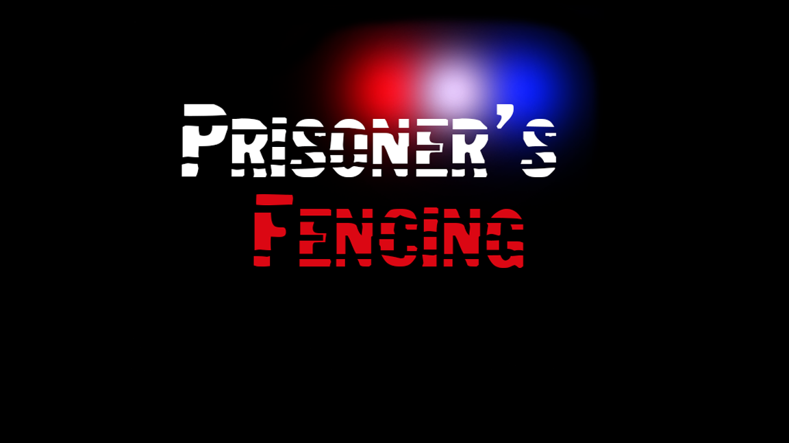
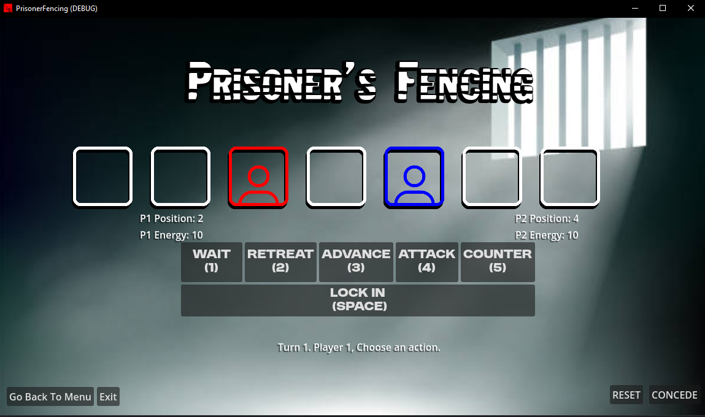

# Prisoner_Fencing

[Link To Game On Itch.io](https://wyattalexander-001.itch.io/prisoner-fencing)




## Inspiration:
This game was inspired by a Reddit post on r/gameideas and is my first released game. 

[User: Super_Difference6346](https://www.reddit.com/r/gameideas/comments/1i3ykwt/prisonners_fencing_a_game_i_...)

## About

Prisoner's Fencing is a 2-player turn-based strategy game. 

The objective is either outlasting your opponent by having more energy or KILLING them within a set number of turns.

## 🕹️ Actions Available to Players

```
WAIT (1-Key)
The player chooses to stay in their current position.
Effects: +1 Energy
```

```
RETREAT (2-Key)
The player moves one square away from their opponent.
Effects:-1 Energy
```
```
ADVANCE (3-Key)
The player moves one square toward their opponent.
DOUBLE ATTACK DAMAGE on the NEXT turn only.
If Both Players Advance to the Same Open Square:
Internal Coin Flip: Determines which player occupies the square.
Winner: Takes the position.
Effects:-1 Energy
```
```
ATTACK (4-Key)
Description: The player attempts to attack their opponent.
Effects:-1 Energy Upon Miss
Damage: Normal = 3 // Advanced = 6
If Bother Players Attack, If same strength both players take 0 energy loss, If Advanced vs Normal 3 damage
```
```
COUNTER (5-Key)
Description: The player attempts to counter an incoming attack.
Effects:
If Opponent is Attacking:
Damage Reflection: Reflects the damage back to the attacker at no energy cost.
If Opponent is Not Attacking:
Penalty: Player loses 2 Energy.
```

## 🏁 Winning Conditions

Primary Objective: Eliminate the opponent by reducing their energy to 0.

Secondary Objective: Outlast the opponent by having more energy when the total number of turns is reached.

Draw: If both players have equal energy at the end of the final turn.

[Link To Game On Itch.io](https://wyattalexander-001.itch.io/prisoner-fencing)
